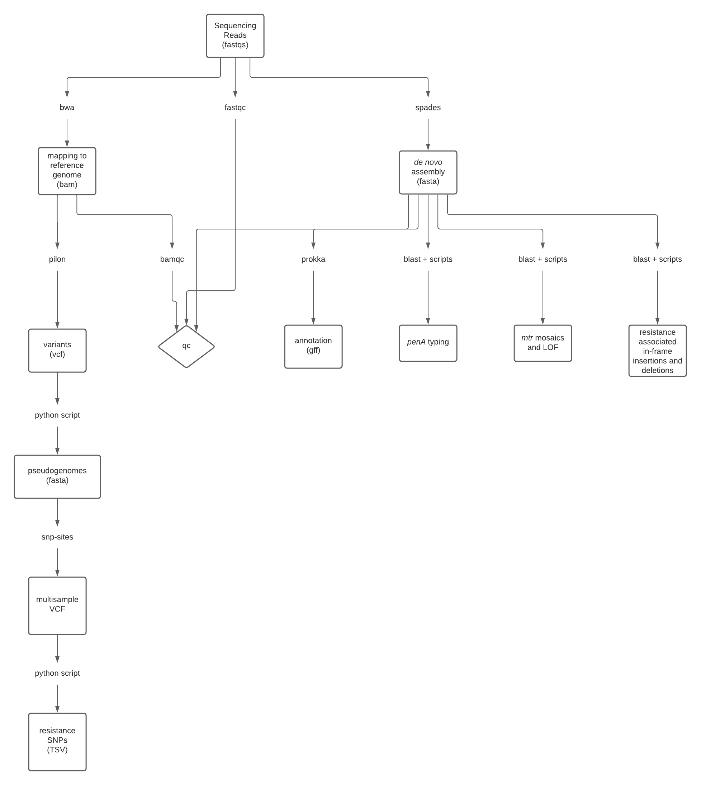

# *N. gonorrhoeae* assembly pipeline implemented in snakemake

## Pipeline Description

This pipeline performs QC, de novo assembly, mapping to a reference genome, annotation, and resistance-associated allele calling using *N. gonorrhoeae* genomic data
sequenced on the Illumina platform as input.



## Installing snakemake
1. [Install conda](https://conda.io/projects/conda/en/latest/user-guide/install/index.html)
2. [Install snakemake](https://snakemake.readthedocs.io/en/stable/getting_started/installation.html)

## Installing biopython
Follow instructions here to install biopython: https://biopython.org/wiki/Download

## Running the pipeline

1. Make a directory for your current project
2. Copy the contents of this directory (`Snakefile`, `start_snakemake.sh`, `conda_envs/`, `reference_sequences/`, `slurm_genomics_pipeline/`)
3. Edit the snakemake config (`slurm_genomics_pipeline/config.yaml`) with your conda installation path, specifically the line that starts with conda-prefix:
4. Edit the submit script (`start_snakemake.sh`) with your email address (you can also update the time/queue/etc. depending on how many isolates you are assembling)
5. Add executable permissions to `slurm-status.py` if needed (`chmod +x slurm_genomics_pipeline/slurm-status.py`)
6. Make a directory called `fastqs` with all your fastqs. Paired end files should be named using [sample_name]\_1.fastq.gz and [sample_name]\_2.fastq.gz naming convention.
7. Submit job using `sbatch start_snakemake.sh`

## Pipeline output

```
annotations/
    A directory for each sample with output from [prokka][https://github.com/tseemann/prokka#output-files]
blastdb/
    A blast database of contigs from assemblies
blast_results/
    Blast results from resistance associated genes
itol/
    ITOL annotation files from resistance associated SNPs (those called from pseudogenomes)
logs/
    Pipeline log files
mapping/
    BAM files for each sample mapped to NCCP11945
mapping_16S/
    BAM files for each sample mapped to the 16S rRNA sequence
mapping_23S/
    BAM files for each sample mapped to a single copy of 23S rRNA
pseudogenomes/
    NCCP11945 reference genome replaced with high quality variant calls or missing data for each sample
qc/
    bamqc/
        bamqc output for each sample
    fastqc/
        fastqc output for each sample
    multiqc_bamqc_data/
        summarized bamqc output
    multiqc_bamqc.html
        HTML representation of summarized bamqc output
    multiqc_bamqc_data/
        summarized fastqc output
    multiqc_bamqc.html
        HTML representation of summarized fastqc output
    qc_summary.txt
        Tab delimited file with the following columns:
            wgs_id: sample name
            assembly_length: total length of assembled contigs after they have been filtered removing short/low coverage contigs
            assembly_coverage: average coverage of filtered contigs as reported in contig headers
            contigs: total number of contigs
            genes: total number of annotated genes
            reference_coverage: average coverage of reads mapped to NCCP11945 reference
            reference_percentage_mapped: the percentage of total reads that mapped to NCCP11945 reference
            percent_missing: the percentage of sites in the reference genome that could not be confidently called in pseudogenome
     
resistance/
variants/
variants_16S/
variants_23S/
```
